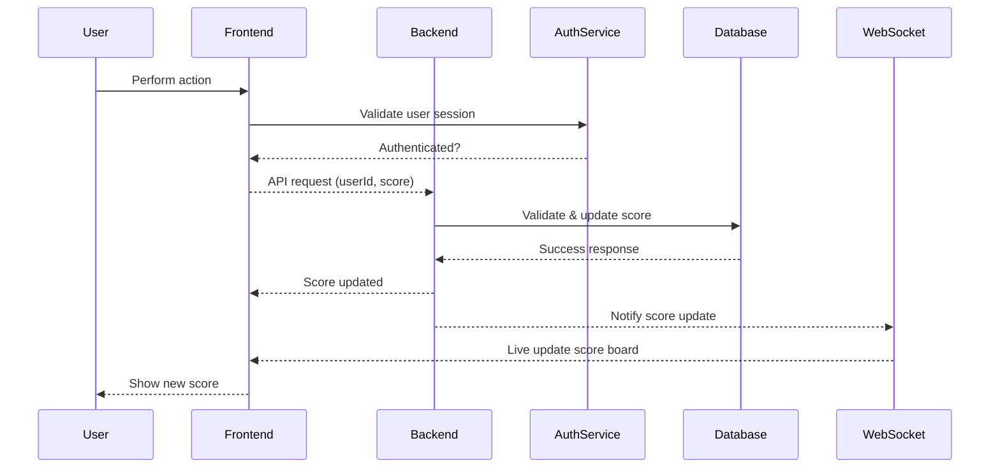

# API Module Documentation

## Overview
This module handles the scoreboard system for a website. It updates and retrieves user scores dynamically.

## Features
- Displays the **Top 10** users with the highest scores.
-   Supports **real-time updates**.
-   Provides an API endpoint to update scores.
-   Implements security to prevent unauthorized score modifications.

## API Endpoints
####  **Get Top 10 Scores**

**Endpoint:** `GET /api/scoreboard`  
**Description:** Returns the top 10 users with the highest scores.  
**Response:**
```json
{
   "scores": [
      {
         "username": "user1",
         "score": 1500
      },
      {
         "username": "user2",
         "score": 1400
      }
   ]
}
```
#### **Update User Score**

**Endpoint:** `POST /api/scoreboard/update`  
**Description:** Updates a user's score when they complete an action.  
**Request Body:**
```json
{
   "userId": "12345",
   "score": 100
}
```
**Response:**
```json
{
   "message": "Score updated successfully"
}
```
##  **Real-time**
-   The system supports **instant score updates** via **WebSocket** or **Server-Sent Events (SSE)**. If WebSocket is used, clients can maintain a persistent connection to receive live updates without polling.

## **Security**

-   **Authentication:**
    -   The API requires **JWT (JSON Web Token)** authentication.
    -   Every request must include an **Authorization header** in the format:
	    `Authorization: Bearer <your_token_here>`
    -   If the token is invalid or expired, the API will return **401 Unauthorized**.
    
-   **Action Validation:**
    -   Ensures that the **userId** in the request matches the **user from the JWT token**.
    -   Prevents users from updating scores for other accounts.
    -   Restricts **manual score modifications** (can be monitored via server logs).
    
-   **Rate Limiting:**
    -   Limits the number of score updates per **user** (e.g., maximum **1 update per second**).
    -   If a user sends too many requests in a short time, the API returns **429 Too Many Requests**.

## Execution Flow


## **Error Handling**
The API handles different error scenarios:  

| HTTP Status | Meaning | Possible Causes |
|-------------|---------|----------------|
| **400 Bad Request** | Invalid input | Missing `userId` or `score` in request body |
| **401 Unauthorized** | Authentication failed | Missing or invalid JWT token |
| **429 Too Many Requests** | Rate limit exceeded | User sending too many score updates |
| **500 Internal Server Error** | Unexpected error | Server-side issue, check logs |


## **Possible Enhancements**

-   **Improved Rate Limiting to prevent spam attacks:**
    -   Implement **IP-based** rate limiting to block bot activity.
    -   Use Redis or an API Gateway to efficiently control request rates.
    
-  **Scoreboard caching for better performance:**
    -   Store **Top 10 Scores** in Redis to reduce database load.
    -   Refresh cache only when a score update occurs instead of querying the database every time.
    
-  **Automatic Score Decay for Fairness:**
    -   Implement a system where inactive users gradually **lose points** over time.
    -   Ensures fairness by preventing old scores from staying permanently high.
